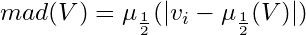

# atlas-mad

Calculates the median absolute deviation of a set of data points in-place.

[](https://travis-ci.org/[username]/[repo])

---

## install

```
npm install --save atlas-mad
```

## why

Breaking up [atlas-dataset](https://github.com/atlassubbed/atlas-dataset#readme) into standalone functions. This module computes the median absolute deviation (MAD) over an array of numbers:

<p align="center">
  
</p>

The MAD is a more robust measure of "spread" in a distribution because it does not suffer from quadratic outlier contributions, unlike the standard deviation. The MAD is useful for cases where your data contains a small number of outliers (e.g. programming benchmarks).

## examples

#### unsorted array

The `mad` function sorts the array in-place before calculating the median absolute deviation.

```javascript
const mad = require("atlas-mad")
console.log(mad([4,3,1,2]))
// 1
```

#### sorted array

To avoid sorting a pre-sorted array, use a boolean flag:

```javascript
...
const isSorted = true;
console.log(mad([1,2,3,4,5], isSorted)) // fast
// 1
```